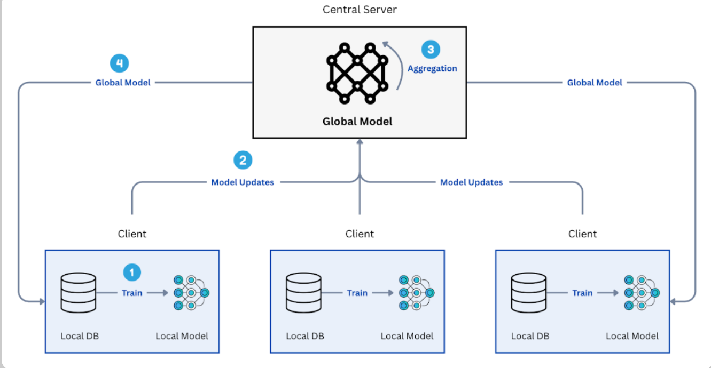
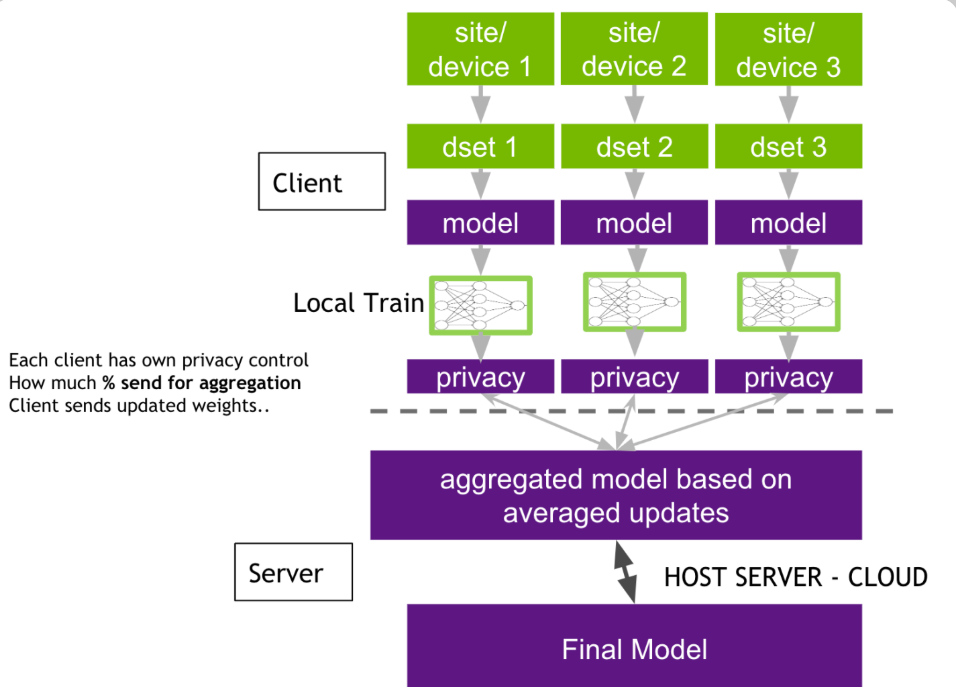
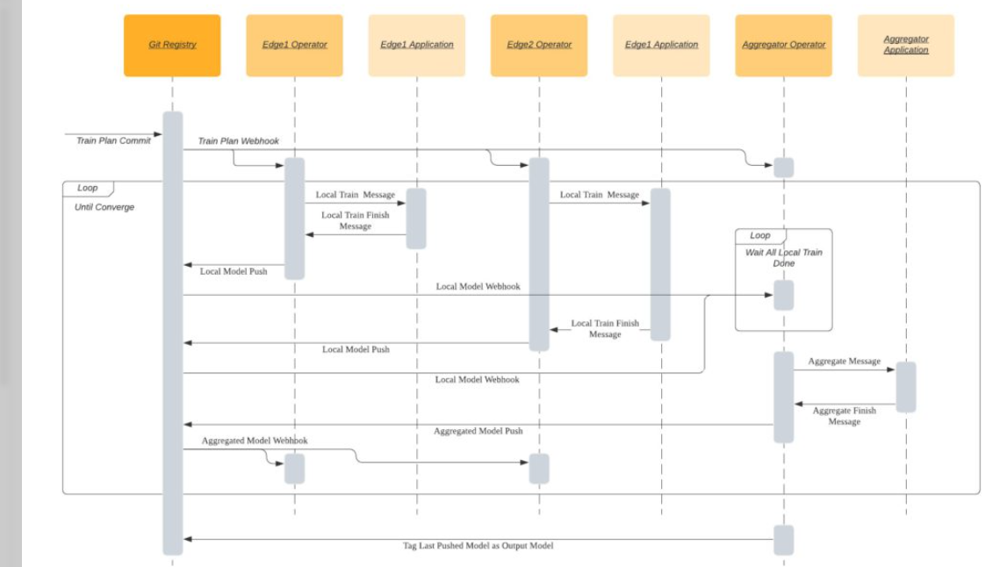

##### Executive summary


**Federated Learning** (FL) is a decentralized machine learning paradigm that enables collaborative model training across multiple distributed participants—such as edge devices, mobile phones, edge servers, or organizational silos—without ever centralizing or exchanging raw data. Instead of uploading sensitive datasets to a single repository, participants train models locally on their private data and share only model updates (e.g., gradients or parameter deltas). A central orchestrator aggregates these updates to iteratively refine a shared global model, using techniques like Federated Averaging (FedAvg) while preserving data locality.


**Centralized data aggregation**, the traditional approach to training AI models, poses severe and escalating problems in today's data landscape. It creates single points of failure for breaches, exposes organizations to massive regulatory penalties (e.g., GDPR, CCPA, HIPAA violations), violates data sovereignty and cross-border transfer restrictions, incurs prohibitive costs and latency in moving petabyte-scale data, and risks intellectual property leakage or competitive disadvantage in collaborative scenarios. As data volumes explode and privacy expectations rise—driven by consumer awareness, stricter laws, and high-profile incidents—centralized approaches increasingly hinder innovation, especially in high-stakes domains like healthcare, finance, IoT, autonomous systems, and cross-organizational AI.
This blueprint delivers a comprehensive, production-grade architecture and set of practices for implementing secure, scalable federated learning systems that overcome these barriers. It provides:

A modular reference architecture (client-server with extensions for peer-to-peer or hierarchical variants) incorporating robust components for orchestration, secure aggregation, communication efficiency, and fault tolerance.
Advanced security and privacy controls, including differential privacy (DP), secure multi-party computation (SMPC), homomorphic encryption, robust aggregation against poisoning attacks, and defenses against inference/extraction risks.
Production engineering best practices covering heterogeneity handling (non-IID data, device variability), communication optimization (compression, quantization, asynchronous updates), monitoring and observability, model versioning, drift detection, personalization strategies, and seamless integration with existing ML pipelines (e.g., PyTorch, TensorFlow, Flower, FedML, or NVIDIA FLARE).
Deployment patterns for real-world scenarios: edge-to-cloud, cross-silo (enterprise consortia), mobile fleets, and regulated industries, with guidance on performance tuning, cost modeling, and regulatory compliance.

This document is written for **technical decision-makers and implementers** who need actionable depth rather than academic overviews:

ML/AI engineers and data scientists building distributed systems.

System architects and DevOps/SRE teams designing scalable, resilient infrastructure.

Security and privacy engineers ensuring compliance and threat mitigation.

Enterprise architects and compliance officers evaluating federated approaches for strategic AI initiatives.

By following this blueprint, organizations can unlock high-quality, collaborative AI models that leverage distributed, real-world data distributions—achieving superior generalization, reduced latency, lower bandwidth consumption, and fundamentally stronger privacy guarantees—while minimizing legal, operational, and reputational risks in a privacy-first world.

#### Introduction

**The Problem with Centralized AI Training**

Traditional centralized machine learning—where raw data from distributed sources is aggregated into a single repository for model training—has powered much of modern AI's success. However, as datasets grow to petabyte scale, privacy expectations evolve, regulations tighten, and collaboration across silos becomes essential, this paradigm reveals fundamental and escalating flaws. These issues manifest in four interconnected categories: data privacy risks, regulatory pressure, data ownership and trust barriers, and scalability bottlenecks. Each not only increases operational and financial risk but also stifles innovation in privacy-sensitive and distributed environments.

**1. Data Privacy Risks**

Centralized training creates an irresistible target for adversaries. By consolidating sensitive data—personal health records, financial transactions, user behaviors, biometric information, proprietary business data—into one location, organizations dramatically expand the attack surface. A single breach can expose millions or billions of records, leading to identity theft, fraud, blackmail, or competitive intelligence loss.

**High-profile incidents underscore the severity:** Major platforms have suffered breaches exposing tens of millions of users' personal details (e.g., names, emails, locations, and behavioral data) due to inadequate security controls around centralized storage and access.
Inference and reconstruction attacks further compound the issue—even anonymized or aggregated datasets can leak sensitive information when used in training, as models memorize patterns that allow reconstruction of individual data points.

**Volume amplifies vulnerability:** Modern AI, especially large language models and multimodal systems, ingests terabytes to petabytes of data, inevitably including sensitive elements scraped from public sources or collected via user interactions. This scale makes perfect de-identification nearly impossible, turning central repositories into privacy time bombs.

In contrast to federated approaches (where raw data never leaves its origin), centralization forces data movement and long-term storage, violating core privacy principles like data minimization and purpose limitation.

**2. Regulatory Pressure (GDPR, HIPAA, CCPA, EU AI Act, and Beyond)**

Global privacy and AI regulations have shifted decisively against unrestricted data centralization. Laws now treat personal data as a protected right, imposing strict requirements on collection, transfer, processing, and cross-border movement.

**GDPR (EU)** and equivalents like CCPA/CPRA (California), PDPA (various jurisdictions), and sector-specific rules (HIPAA for health data) mandate explicit consent, data minimization, rights to access/erase, and accountability for breaches. Cross-border transfers require adequacy decisions or safeguards—often impractical for centralized training involving global data.

**Enforcement is aggressive:** Cumulative GDPR fines exceed billions of euros, with landmark penalties against companies for unlawful data processing, insufficient security (Art. 32), and non-transparent practices. Examples include massive fines for breaches exposing user data via inadequate encryption or access controls, and sanctions against firms scraping biometric data without consent for AI training.

**Emerging AI-specific rules** (e.g., EU AI Act) classify high-risk systems and demand transparency, bias audits, and risk assessments—requirements that become exponentially harder when data is pooled centrally, as lineage, provenance, and compliance audits are obscured.

**Data sovereignty and residency** mandates (e.g., in China, India, or certain EU member states) prohibit or heavily restrict moving sensitive data abroad, blocking centralized training across borders or organizations.

Non-compliance risks not just fines (up to 4% of global revenue under GDPR) but operational shutdowns, reputational damage, and loss of market access. Centralized approaches increasingly force organizations to choose between innovation and legal viability.

**3. Data Ownership and Trust Issues**
Centralization erodes trust between data holders and model developers. Participants (individuals, hospitals, banks, device owners) relinquish control once data leaves their perimeter, raising concerns about secondary use, monetization without benefit, or misuse.

**Ownership ambiguity :** Who truly owns derived insights from pooled data? Contributors often receive no compensation or visibility, fostering reluctance to share.

**Trust deficits in consortia :** Cross-organizational collaboration (e.g., hospitals training disease-detection models or banks sharing fraud patterns) stalls when parties fear IP leakage, competitive disadvantage, or unequal benefit.

**Ethical and bias amplification :** Pooled data can over-represent dominant sources, leading to biased models that perform poorly on underrepresented groups—exacerbating fairness issues and eroding public trust in AI.

These dynamics create a "data silo" reality: Valuable datasets remain locked away due to distrust, limiting model quality and generalizability.

**4. Scalability Bottlenecks**

Centralized training hits hard physical and economic limits as data volumes explode.

**Data movement costs and latency :** Transferring petabytes over networks incurs massive bandwidth charges (e.g., cross-region fees of $0.09–$0.12/GB), network congestion, and delays. Training pipelines become I/O-bound, with data staging and preprocessing stalling GPUs/TPUs—sometimes consuming 40–60% of total runtime.

**Infrastructure strain :** Central repositories demand enormous storage, high-throughput ingress, and fault-tolerant systems. Scaling compute (e.g., GPU clusters) is expensive and power-intensive, while single points of failure reduce resilience.

**Heterogeneity and freshness issues :** Real-world data is non-stationary; central aggregation introduces staleness (critical in finance, IoT, or autonomous systems) and struggles with non-IID distributions across sources.

**Economic reality :** At frontier scales, data transfer and storage often rival or exceed compute costs, turning what should be an intelligence advantage into a logistical liability.

These bottlenecks cap achievable model performance and make centralized training impractical for edge-heavy, real-time, or privacy-constrained use cases.

Centralized AI training—once the default—now imposes unacceptable trade-offs in privacy, compliance, trust, and scale. Federated learning addresses these by design: keeping data local, sharing only model updates, enabling collaborative intelligence without the central honeypot. The remainder of this blueprint details how to implement federated systems at production grade, turning these problems into strategic opportunities.

**Why Federated Learning Matters**

Federated Learning (FL) is not merely a privacy-preserving alternative—it's a strategic enabler for next-generation AI in a world where data is inherently distributed, sensitive, and regulated. By training models collaboratively across decentralized nodes while keeping raw data local, FL directly resolves the core problems of centralized training outlined earlier. It delivers superior privacy, enables previously impossible collaborations, reduces infrastructure costs, and aligns with real-world data dynamics (edge-heavy, non-IID, real-time).

**1. Data Locality: The Foundation of Efficiency and Compliance**

Data locality means raw data never leaves its source—training happens on-device (cross-device FL) or within organizational perimeters (cross-silo FL). This yields multiple engineering and business advantages:

**Bandwidth and latency savings** — No massive data uploads; only compact model updates (gradients, weights) are exchanged. In edge scenarios (e.g., IoT sensors, autonomous vehicles), this reduces network load by 90–99% compared to centralized ingestion.

**Regulatory alignment** — Satisfies data residency laws (e.g., EU GDPR Art. 44–50, India's DPDP Act, China's PIPL) and sovereignty requirements without complex adequacy mechanisms or contractual safeguards.

**Real-time freshness** — Models train on the latest local data distributions, critical for non-stationary environments like fraud detection, predictive maintenance, or personalized recommendations.

**Reduced central storage** — Eliminates petabyte-scale warehouses, slashing costs (storage + egress fees) and single-point-of-failure risks.

In production, data locality enables hybrid architectures: edge devices perform local training, intermediate edge servers aggregate regionally, and a cloud orchestrator finalizes global models—balancing latency, cost, and scale.

**2. Privacy-Preserving Collaboration**

FL unlocks collaborative intelligence without trust erosion or data exposure. Key mechanisms include:

**Secure aggregation** — Servers receive masked/encrypted updates (e.g., via secure multi-party computation or threshold homomorphic encryption), preventing reconstruction of individual contributions.

**Differential privacy (DP)** — Noise addition (e.g., Gaussian DP-SGD) bounds leakage risk, with tunable ε values for utility-privacy trade-offs.

**Defenses against attacks** — Robust aggregation (Krum, median, trimmed mean) mitigates poisoning; client-side DP and secure enclaves (e.g., NVIDIA H100 Confidential Computing) guard against inference attacks.

**This enables high-stakes consortia:**

Multiple hospitals train cancer diagnostics without sharing patient scans.

Banks collaborate on fraud models across jurisdictions.

Device fleets improve personalization without uploading user histories.

3. Real-World Adoption Drivers (as of 2026)
FL has transitioned from research to production-scale deployment, driven by regulation, market maturity, and proven ROI. Market projections show explosive growth: from ~$0.1–0.3B in 2025 to $1.6B+ by 2035 (CAGR 27–44%), with healthcare and finance leading.

**Key drivers and examples:**

Regulatory pressure as catalyst — GDPR enforcement, EU AI Act (high-risk system requirements), HIPAA updates, and cross-border restrictions force privacy-by-design. FL becomes the compliant path for collaborative AI.

Privacy scandals and trust erosion — High-profile breaches accelerate shift to decentralized paradigms.

Edge explosion — Billions of IoT/5G devices generate real-time data unsuitable for centralization.

Industry consortia — Cross-silo FL in regulated sectors unlocks value pools previously locked by silos.

**Real-world production examples**

Google Gboard — Cross-device FL at planetary scale: millions of Android devices improve next-word prediction via local training and secure aggregation—still a benchmark for mobile personalization.

Apple Federated Analytics / Siri improvements — On-device learning for keyboard suggestions and voice recognition, preserving user privacy.

Healthcare consortia — Owkin (biotech) and Cancer AI Alliance (Fred Hutchinson, Dana-Farber, MSK, NVIDIA, AWS, Microsoft) use FL for multi-institutional cancer diagnostics and genomics—e.g., training on imaging without centralizing PHI.

NVIDIA FLARE — Widely adopted in healthcare (COVID-19 outcome prediction, genomic research with Erasmus MC), finance (confidential consortia), and edge AI; integrates DP, homomorphic encryption, and confidential computing.

Finance — Cross-bank fraud detection and credit scoring (20%+ market share in FL applications), enabling secure anomaly detection without sharing transaction logs.

Automotive / IoT — Predictive maintenance and autonomous driving enhancements via federated updates from vehicle fleets.

These deployments demonstrate FL's maturity: accuracy comparable to centralized baselines (often within 1–5% under IID conditions, sometimes better on non-IID real data), with dramatically lower risk.

**Comparison: Federated vs. Centralized Training**

### Federated Learning vs Centralized Training (Production Context)

| Category | Federated Learning | Centralized Training | Winner (Production Context) |
|--------|--------------------|----------------------|-----------------------------|
| Data Privacy | High: Raw data stays local; only model updates shared | Low: Full dataset centralized, creating a breach honeypot | Federated |
| Regulatory Compliance | Strong: Aligns with GDPR, HIPAA, EU AI Act, data residency laws | Challenging: Requires cross-border transfers, anonymization, legal approvals | Federated |
| Bandwidth / Cost | Low: Model deltas only (KB–MB per round) | High: Full data upload (GB–PB) plus egress fees | Federated |
| Latency / Freshness | Low latency; near real-time local updates | Higher latency due to data movement; staleness risk | Federated |
| Scalability | Horizontal: Millions of nodes; handles device and data heterogeneity | Vertical: Limited by centralized compute/storage; single point of failure | Federated |
| Collaboration | Enables cross-organization and cross-device consortia | Limited by trust, ownership, and legal barriers | Federated |
| Model Performance | Comparable or better on non-IID real-world data; DP can trade accuracy | Slightly higher on clean, IID centralized datasets | Tie / Federated edge |
| Attack Surface | Distributed; poisoning mitigated via robust aggregation | Centralized, high-value target for attacks | Federated |
| Deployment Complexity | Higher: Heterogeneous clients, communication, and security layers | Lower: Simpler training pipeline | Centralized |

In production engineering, federated approaches win when privacy, scale, or distribution dominate—now the majority of high-stakes use cases.

**2.3 Scope and Assumptions**

**What this blueprint covers**

This document provides a production-grade, end-to-end blueprint for building, deploying, and operating federated learning systems at scale. It focuses on:

Modular reference architectures (cross-device, cross-silo, hierarchical).

Secure primitives (DP, SMPC, secure aggregation, confidential computing).

Handling real-world challenges: non-IID data, system heterogeneity, stragglers, poisoning, drift.

Frameworks and tools (Flower, FedML, NVIDIA FLARE, TensorFlow Federated, PySyft integrations).

Production practices: monitoring, versioning, rollback, cost modeling, A/B testing, personalization (e.g., FedProx, SCAFFOLD, clustered FL).

Deployment patterns for regulated industries (healthcare, finance, automotive).

Performance benchmarks, trade-off analysis, and migration paths from centralized ML.

**What it intentionally excludes**

Purely academic / theoretical proofs (e.g., convergence under arbitrary non-IID).

Low-level crypto implementations (use battle-tested libraries).

Specific vendor lock-in (focus on open, interoperable patterns).

Consumer mobile app development details (focus on backend + edge orchestration).

Emerging but immature areas like fully decentralized P2P FL or blockchain-orchestrated FL.

**Production vs. research focus**

This is explicitly a production engineering blueprint, not a research survey. It prioritizes:

Battle-tested techniques over bleeding-edge papers.

Operational reliability, observability, and cost over marginal accuracy gains.

Compliance-first design (audit trails, governance, explainability).

Actionable code patterns, config examples, and decision frameworks.

### 2 Fundamentals of Federated Learning

Federated Learning (FL) is a distributed machine learning paradigm where multiple participants collaboratively train a shared model while keeping their raw data decentralized and private. The core innovation lies in exchanging only model updates (e.g., gradients or parameter deltas) rather than data, enabling privacy-preserving, scalable collaboration across heterogeneous environments.

**Core Concepts**

**FL operates** through an iterative client-server protocol involving a central server (orchestrator) and multiple clients (data-holding nodes).

**Global model** (w^t at round t): A single shared model maintained by the server. It represents the collective knowledge aggregated from all participants. Initialized randomly or from a pre-trained checkpoint, it is broadcast to clients at the start of each round and updated via aggregation.

**Local models** (w_k^t for client k): Copies of the global model fine-tuned on each client's private local dataset D_k. Clients perform local optimization (typically SGD or variants) for several epochs, producing updated parameters or gradients.

**Rounds** (communication rounds or epochs): Discrete iterations of the FL loop. In each round:

(a). Server selects a subset of clients (random or stratified sampling for efficiency).

(b). Broadcasts current global model.

(c). Clients train locally → compute updates.

(d). Clients send updates back.

(e). Server aggregates → produces new global model.

Rounds continue until convergence (e.g., validation loss plateau) or a fixed budget (e.g., 100–1000 rounds in production).

**Aggregation:** The server's key operation to combine client updates into the next global model. Weighted averaging is common, accounting for dataset size or contribution quality.

**Clients vs Server:**

Clients: Edge devices (phones, IoT), edge servers, or organizational silos. Heterogeneous in compute, bandwidth, data volume/distribution (non-IID), availability (stragglers/dropouts).

Server: Trusted coordinator (cloud or on-prem). Handles selection, broadcasting, aggregation, and model distribution. In secure variants, it may use encrypted aggregation to remain oblivious to individual contributions.

**Typical FL Loop Diagram**



This illustrates clients training locally on private data, sending only model updates (not data) to the server for aggregation into an improved global model.

**Federated Learning Paradigms**
FL paradigms differ by scale, data partitioning, and collaboration type.

**Cross-device FL:** Millions of unreliable, resource-constrained clients (e.g., smartphones, IoT sensors). Focus: communication efficiency, fault tolerance, secure aggregation. Example: Google Gboard next-word prediction.

**Cross-silo FL:** Small number (10s–100s) of reliable, high-capacity participants (e.g., hospitals, banks, enterprises). Focus: high-stakes privacy, regulatory compliance, complex models. Example: multi-institutional healthcare consortia using NVIDIA FLARE

**Cross-Device vs Cross-Silo Federated Learning**

| Aspect | Cross-Device FL | Cross-Silo FL | Production Implication |
|------|-----------------|---------------|------------------------|
| # Participants | 10⁵–10⁹ clients (massive scale) | 10–100 participants | Cross-device requires dropout-robust client selection |
| Reliability | Low (battery constraints, intermittent connectivity) | High (always-on servers) | Cross-silo supports synchronous or full-model updates |
| Data Volume per Client | Small (KB–GB) | Large (TB+) | Cross-silo can handle complex, highly non-IID datasets |
| Heterogeneity | Extreme (devices, networks, data quality) | Moderate (institutional environments) | Cross-device prioritizes compression and robustness |
| Primary Use Cases | Mobile personalization, keyboards, IoT | Healthcare, finance, enterprise consortia | Choice depends on trust model and deployment scale |

**Horizontal vs Vertical FL (data partitioning):**

**Horizontal FL** (sample-based, most common): Clients share the same feature space but different samples (e.g., different users' typing data for the same keyboard model). Enables simple FedAvg-style aggregation.

**Vertical FL** (feature-based): Clients share the same samples but different features (e.g., bank has transaction features, retailer has purchase history for same customers). Requires entity alignment + secure computation (e.g., encrypted gradients) to train jointly.

**Horizontal vs Vertical Illustration:**


**Federated Learning vs Traditional Distributed Training**

Traditional distributed training assumes centralized data or trusted cluster; FL assumes decentralized, privacy-sensitive data.

**Federated Learning vs Traditional Distributed Training**

| Aspect | Federated Learning (FL) | Traditional Distributed Training | Key Difference / Production Insight |
|------|-------------------------|----------------------------------|-------------------------------------|
| Data Location | Decentralized (data remains local; never centralized) | Centralized or sharded across trusted nodes | FL preserves privacy, data sovereignty, and ownership |
| Primary Goal | Privacy-preserving collaboration | Maximum speed and scale on large datasets | FL trades some training efficiency for compliance |
| Parallelism Type | Data parallelism only (local subsets) | Data, model, and pipeline parallelism | FL is constrained by privacy boundaries |
| Communication | Model updates only (often sparse and infrequent) | Frequent gradient synchronization (e.g., all-reduce) | FL reduces bandwidth usage by ~90–99% |
| Architecture | Client–server orchestration with aggregation | Parameter servers or decentralized collectives (e.g., Horovod) | FL server aggregates updates, not raw gradients |
| Heterogeneity Handling | Built-in support (non-IID data, stragglers, device variance) | Assumes IID data and homogeneous hardware | FL algorithms (e.g., FedProx, FedAvgM) mitigate drift |
| Use Case Fit | Edge devices, regulated domains, cross-organization training | HPC clusters, single-organization large datasets | FL matches real-world data distribution constraints |

In traditional setups, parameter servers store and serve parameters; workers compute gradients. FL uses parameter-server-like orchestration but for privacy-preserving aggregation only—no full data sharding.

**Common Algorithms**

Production FL builds on these battle-tested aggregation methods:

**FedAvg** (Federated Averaging, 2017 baseline): Weighted average of local models, weighted by dataset size. Simple, efficient, but sensitive to non-IID data (client drift).Pseudocode sketch:text
```python
Server: w_global ← initialize()
for each round t:
    select subset S of clients
    broadcast w_global to S
    for each client k in S:
        w_local ← w_global
        for local epochs E:
            w_local ← SGD(w_local, D_k, lr)
        send Δw_k = w_local - w_global (or full w_local)
    w_global ← ∑_{k in S} (n_k / n_total) * w_k   # weighted avg
```

**FedProx** (2018/2020): Adds proximal term μ/2 ||w_local - w_global||² to local loss → prevents excessive drift in heterogeneous settings. Robust to partial work, dropouts.

**FedNova** (2020): Normalizes updates by local steps τ_k and effective learning rate → eliminates objective inconsistency from varying local epochs. Faster convergence, fewer rounds on non-IID.

**Federated Learning Algorithm Comparison (2026 Production View)**

| Algorithm | Problem Addressed | Strengths | Weaknesses | Best Use Cases (2026) |
|---------|------------------|-----------|------------|----------------------|
| FedAvg | Baseline federated optimization | Simple, low communication and compute overhead | Performs poorly on extreme non-IID data; client drift | IID-ish data, cross-device FL baselines, experimentation |
| FedProx | Statistical + system heterogeneity | Stable convergence, tolerant to dropouts and stragglers | Extra local computation due to proximal term | Heterogeneous devices, regulated cross-silo environments |
| FedNova | Objective inconsistency across clients | Normalized updates → fairer aggregation, faster convergence | Requires tracking local steps and normalization factors | Highly non-IID data, communication-constrained production systems |

### 3 Threat Model & Security Foundations

Federated Learning (FL) shifts data risks from central repositories to distributed model updates, but it introduces new attack surfaces. Production FL systems must assume adversaries can compromise clients, eavesdrop on communications, or control the server. This section defines the core threat model, maps key risks, and outlines foundational security principles that underpin the blueprint's architecture and practices.

**Threat Landscape in Federated Systems**

**FL operates under a client**-server model with potentially untrusted participants. We adopt a hybrid threat model combining:

**Honest-but-curious (semi-honest) server** — Follows the protocol but attempts to infer private client data from received updates (gradients/parameters). Common in large-platform deployments (e.g., mobile FL).

**Malicious (Byzantine) clients** — Arbitrarily deviate: send poisoned updates to degrade/steal from the global model or extract others' data.

**Passive eavesdroppers** — Intercept network traffic (e.g., man-in-the-middle on unsecured channels).

**Colluding adversaries** — Malicious clients + curious/malicious server coordinating attacks.

**Key Attack Vectors**

**Model poisoning — Malicious clients craft updates to:**

Degrade global accuracy (targeted or untargeted).

Inject backdoors (trigger on specific inputs).

Cause denial-of-service (e.g., divergent updates).

Recent works show scaling to large batches/tokens; defenses like robust aggregation (Krum, median) or loss-trend detection are critical.

**Data inference attacks** — Exploit shared updates to reconstruct/extract sensitive information

**Threat landscape**


This diagram shows the training phase with model updates flowing to a central server (potential poisoning from malicious clients) and inference risks on the aggregated global model.

**Threat Comparison: Cross-Device vs Cross-Silo Federated Learning**

| Threat Actor | Cross-Device FL (Millions of Clients) | Cross-Silo FL (10s–100s Orgs) | Impact Severity | Mitigation Priority |
|-------------|----------------------------------------|-------------------------------|------------------|---------------------|
| Honest-but-curious server | High risk due to massive gradient collection at scale | Medium risk; fewer but richer updates | Privacy leakage | Secure aggregation, differential privacy |
| Malicious clients | High risk: Sybil attacks and poisoning easy at scale | Medium risk: harder to hide, higher accountability | Model corruption, backdoors | Robust aggregation, client verification |
| Eavesdropping | High risk: public / untrusted networks | Medium risk: often private or VPN links | Update interception | End-to-end encryption |
| Collusion (clients + server) | Medium–High risk | High risk in coordinated consortia | Severe privacy + integrity breach | Zero-knowledge proofs, verifiable computation |

**Privacy Risks in Gradient Sharing**

Even with data locality, gradients encode rich information about local data. Without protections, attackers exploit this via:

**Membership inference** — Determine if a specific record was in a client's training set (e.g., by querying loss differences or shadow models). Success rates 60–90% on non-IID data; amplified in FL due to distributional skew.

**Model inversion / attribute inference** — Recover sensitive features or labels (e.g., reconstruct facial attributes from gradients). Works even on aggregated updates in some cases.

**Reconstruction attacks (gradient inversion)** — Directly reconstruct raw inputs from gradients (e.g., DLG/iDLG, Inverting Gradients). Recent 2024–2026 studies show:

Passive honest-but-curious server can extract 20+ high-fidelity images from ImageNet-scale batches.

Malicious server (occasionally Byzantine) boosts efficiency via adversarial initialization or weight manipulation.

Harder on complex/realistic data (CelebA, high-res), but still viable on medical imaging or text.

**Privacy Attack Illustration**


**Attack Feasibility Table**

| Attack Type | Attacker Position | Success Rate (Simple Datasets) | Success Rate (Complex / Real Data) | Key Papers (Recent) | Primary Mitigation |
|------------|------------------|-------------------------------|-----------------------------------|--------------------|--------------------|
| Membership Inference | Server / external adversary | 70–95% | 50–80% | Survey literature (2024–2025) | Differential privacy, gradient compression |
| Model Inversion | Server | 60–90% | 30–70% | Geiping et al. extensions (2021–2025) | DP-SGD, secure aggregation |
| Gradient Reconstruction | Honest-but-curious server | High (e.g., MNIST) | Medium (CIFAR, ImageNet) | Zhu et al. DLG + 2020–2025 variants | Local DP, gradient clipping |
| Property Inference | Server / colluding clients | 65–85% | 40–70% | Melis et al. + recent surveys | Differential privacy, feature masking |

Risks are higher in cross-device (more updates) and non-IID settings (skew leaks membership).

**Security Design Principles**

Production FL demands rigorous principles to counter the threats above:

**Least trust assumption** ("never trust, always verify") — Treat all clients and the server as potentially compromised. No participant has inherent trust; every update/action requires validation (e.g., via trust scoring, behavioral auditing, or verifiable credentials).

**Zero-knowledge mindset** — Minimize information leakage: server should learn only the aggregated result (not individual contributions). Use zero-knowledge proofs or secure aggregation protocols where possible to prove correctness without revealing inputs.

**Defense in depth** — Layer multiple controls so single failures don't compromise the system:

  (A) **Cryptographic base** — Secure aggregation (additive homomorphic encryption, SMPC, threshold schemes) hides individual updates.

  (B) **Privacy amplification** — Differential Privacy (local/central DP-SGD, DP-FTRL) bounds leakage with tunable ε.

  (C). **Robustness layer** — Byzantine-robust aggregation (Krum, geometric median, trimmed mean), poisoning detection (loss-trend deviation, norm-based filtering).

  (D). **Verification & auditing** — Verifiable computation, blockchain-style logging, client authentication, model watermarking.

  (E) **Confidential computing** — Trusted execution environments (e.g., Intel SGX, NVIDIA Confidential Computing) for server-side operations.

  (F). **Monitoring & response** — Drift detection, anomaly alerts, model rollback.


**Layered Defense Mapping**

| Layer | Principle Alignment | Covers Which Threats | Production Examples |
|------|--------------------|---------------------|--------------------|
| Secure Aggregation | Zero-knowledge; minimize trust in server | Honest-but-curious server inference; eavesdropping | Google SecAgg, NVIDIA FLARE |
| Differential Privacy | Least trust + defense-in-depth | Gradient reconstruction, membership inference, property inference | Opacus, TensorFlow Privacy |
| Robust Aggregation | Least trust (Byzantine resilience) | Malicious clients, poisoning, Sybil attacks | Krum, Median, Trimmed Mean (Flower, FedML) |
| Confidential Computing | Defense-in-depth | Server compromise, insider threats | NVIDIA H100 TEEs, Azure Confidential VMs |
| Behavioral Auditing | Least trust + monitoring | Collusion, free-riding, slow poisoning | Loss-trend anomaly detection (2026 literature) |

These principles form the non-negotiable foundation. Subsequent sections detail implementation patterns (e.g., DP calibration, robust agg configs) that operationalize them.

### Federated Learning System Architecture

A production FL system must balance privacy, efficiency, reliability, and observability while handling massive scale (millions of clients) or high-stakes silos (regulated consortia). The architecture is client-server centric with extensions for hierarchical/edge aggregation and secure primitives.

**High-Level Architecture Overview**

**The core components form a decoupled, microservices-friendly design:**

Client nodes — Edge devices, mobile phones, IoT sensors, or enterprise silos. Perform local training on private data, generate secure updates, and communicate sporadically.

Coordinator / server (orchestrator) — Central (cloud) or distributed service that manages rounds, selects participants, broadcasts models, and coordinates aggregation.

Secure aggregation service — Dedicated (often separate) component or protocol layer that computes masked sums of updates without revealing individuals (e.g., via secure multi-party computation, threshold homomorphic encryption, or Google's SecAgg protocol).

Model registry — Versioned storage for global models, checkpoints, and metadata (e.g., round number, metrics, DP noise parameters). Supports rollback, A/B testing, and compliance auditing.

**High-Level Architecture**


This diagrams show the bidirectional flow: global model broadcast → local training → secure update submission → aggregation → updated global model.

| Component | Cross-Device FL (Mobile / IoT) | Cross-Silo FL (Healthcare / Finance) | Key Production Considerations |
|---------|-------------------------------|-------------------------------------|-------------------------------|
| Client Nodes | Millions of devices; intermittent, low-power | 10s–100s organizations; always-on, high-compute | Extreme heterogeneity, compression, dropout tolerance |
| Coordinator / Server | Cloud-scale; stateless or lightly stateful | On-prem or hybrid; strongly stateful | High availability, rate limiting, auditability |
| Secure Aggregation Service | Mandatory (SecAgg + DP assumed) | Often required (SMPC or TEEs) | Latency vs privacy vs regulatory guarantees |
| Model Registry | Cloud object storage (S3-compatible) | Versioned, auditable registries (MLflow, W&B, Git-like) | Immutability, lineage, provenance tracking |

**Client Architecture**

Clients are lightweight, autonomous agents with strong security boundaries.

**Local data storage** — Private, on-device or on-prem datastore (e.g., SQLite, LevelDB, HDF5). Data never leaves; supports streaming for large datasets.

**Training loop** — Framework-agnostic (PyTorch, TensorFlow, JAX). Implements:

Receive global model → load into local optimizer.

Local epochs (E=1–20) or steps with FedProx/FedNova loss.

Gradient clipping + local DP noise (Gaussian mechanism).

Compression (quantization, sparsification, Top-K).

**Secure update generation** — Mask/encrypt delta before transmission (e.g., additively homomorphic masks for SecAgg). Include metadata (dataset size, local loss).

**Client-Side Architecture Diagram (local training loop and secure update):**


**Production Patterns:**

Asynchronous training (opportunistic when device idle/charging).

Personalization layer (e.g., keep local head, federate backbone).

Failure recovery (checkpoint local state).

 **Server / Orchestrator Architecture**

The server is the reliable brain—designed for fault tolerance and observability.

**Round coordination** — Stateful FSM (finite state machine): init round → select clients → broadcast → wait for updates → aggregate → validate → publish new global model.

**Client selection** — Strategies: random (cross-device), stratified (by data quality), active (high-contribution clients), or availability-based (predicted online time).

**Model aggregation** — Weighted FedAvg / FedProx / FedNova. Apply robust methods (Krum, trimmed mean) against poisoning.

**Failure handling** — Timeout stragglers, partial aggregation (e.g., ≥70% participation), retry queues, drift detection.

**Server / Orchestrator Diagram** (round coordination and aggregation):



**Key Modules:**

gRPC/HTTP2 transport layer.

Monitoring (Prometheus metrics: round duration, participation rate, update norms).

Authentication (OAuth2/JWT per client).

**Communication Flow**

Secure, asynchronous protocol (typically gRPC over TLS 1.3).

**Registration** — Client authenticates (OAuth2 or certificate), registers capabilities (compute, dataset size estimate), receives client ID and initial global model.

**Training rounds** — Server initiates round → pushes task config (hyperparams, model version) → clients pull global model.

**Update submission** — Clients push masked/encrypted updates + metadata (via secure channel). Server forwards to aggregation service.

**Global model broadcast** — After aggregation/validation, new model version pushed or pulled by clients in next round.

**Communication Flow Sequence Diagram**



| Step | Actor(s) | Protocol / Message | Security Controls | Failure Handling |
|-----|---------|-------------------|------------------|-----------------|
| Registration | Client ↔ Server | RegisterRequest / RegisterResponse | TLS, OAuth2 / JWT authentication | Retry with exponential backoff |
| Round Start | Server → Clients | TaskConfig (model URI, hyperparams, round ID) | Signed broadcast, version checksum | N/A (clients may join late) |
| Local Training | Client (local) | Local SGD / fine-tuning | Local DP, gradient clipping | Checkpointing & resume |
| Update Submission | Client → Server / Aggregator | UpdateRequest (masked model delta) | Secure aggregation masks, encryption | Timeout → client dropped from round |
| Aggregation | Server + Aggregation Service | Secure sum → unmask at quorum | Threshold decryption, SMPC / SecAgg | Partial aggregation if quorum met |
| Model Broadcast | Server → Clients | NewModelNotification (versioned) | Signed model metadata, hash verification | Lazy pull on next available round |

This architecture supports extensions: hierarchical (regional aggregators), peer-to-peer fallback, or fully decentralized variants. Later sections detail secure aggregation impl, monitoring stacks, and deployment on Kubernetes/edge.

#### Secure Aggregation & Privacy-Preserving Techniques

Secure aggregation ensures the server learns only the sum of client updates—never individuals—while tolerating dropouts and minimizing overhead. Combined with DP and advanced primitives, these techniques form the privacy core of production FL.

**Secure Aggregation Protocols**

Modern protocols use cryptographic masking to hide contributions via additive randomness, enabling exact aggregation despite partial participation.

**Cryptographic masking** — Clients add self-generated random masks + pairwise masks (shared secrets with other clients) to their updates. The server receives masked values; dropped clients' masks are reconstructed and subtracted from the sum.

**Pairwise keys** — Derived via Diffie-Hellman or PRF-seeded key agreement (Bonawitz et al., 2017 baseline). Double masking (self-mask + pairwise) ensures collision resistance and dropout tolerance.

**Dropout resilience** — Protocols tolerate up to threshold D dropouts (e.g., N-D minimum participants) via mask recovery. Recent 2025 advancements (Willow, single-setup HE-based) eliminate per-round setup, support dynamic joins, forward/backward secrecy, and one-shot/asynchronous clients—critical for 5G/edge.

**Secure Aggregation Comparison Table**

| Protocol Family | Masking Type | Dropout Tolerance | Setup Cost | Communication Overhead | Best For (2026) | Key References (Recent) |
|-----------------|--------------|-----------------|------------|-----------------------|----------------|------------------------|
| Pairwise Masking (classic) | Self + pairwise PRF | High (threshold-based) | Per-round key agreement | Medium (O(N²) keys in naive implementation) | Cross-device mobile deployments (Google scale) | Bonawitz et al., 2017; e-SeaFL |
| Single-Setup HE Masking | Additive symmetric HE + negation | High + dynamic joins | One-time setup | Low | Dynamic users, forward secrecy | arXiv:2502.08989 (2025); Willow (2025) |
| Homomorphic + Committee Decrypt | HE + committee-based decryption | Very high (asynchronous) | Minimal sync | Low | Scalable systems with no synchronization | AICrypt 2025; ePrint 2024/936 |
| Secret Sharing Variants | Shamir / Verifiable Secret Sharing | High (threshold-based) | Medium | Higher (shares) | Cross-silo federated learning with collusion risk | Kadhe 2020; Jahani-Nezhad 2022 |

**Secure Aggregation Flow Diagram (masking → masked submission → recovery → sum):**

**Differential Privacy in Federated Learning**

DP adds calibrated noise to bound leakage risk (ε, δ)-DP.

**Noise injection** — Gaussian (preferred for composition) or Laplace; applied locally (per-client) or centrally (on sum). Gradient clipping (norm C) precedes noise.

**Privacy budgets** (ε, δ) — ε controls indistinguishability (lower = stronger privacy); δ small failure probability. Track via RDP accountant for tight bounds.

**Utility vs privacy trade-offs** — Local DP stronger but higher utility loss (5–30% acc drop); central DP better utility via subsampling amplification. Adaptive strategies (2025 ALDP-FL) dynamically allocate budget, improving convergence on non-IID.

**DP Trade-off Benchmarks**

### Differential Privacy FL Variants (2025 Benchmarks)

| Variant / Paper (2025) | Dataset / Setting | ε Target | Accuracy Drop vs Non-DP (%) | Convergence Impact | Key Insight |
|------------------------|-----------------|----------|----------------------------|------------------|-------------|
| Adaptive Local DP (ALDP-FL) | Non-IID medical datasets | 1–5 | 5–12 | Faster than static | Dynamic privacy budget → up to 15% better utility |
| f-DP Decentralized | Random-walk networks | Tunable | 8–18 | Moderate | Pairwise + secret-based noise improves privacy/utility trade-off |
| DP-FedAvg + Haar Wavelet | CIFAR-10 non-IID | 3–8 | 4–10 | Improved | Lower asymptotic noise variance enhances model stability |
| Central DP baselines | FEMNIST | 2–10 | 2–15 | Slower rounds | Subsampling amplification helps mitigate noise impact |

Local DP suits high-privacy mobile; central suits cross-silo with secure agg.
6.3 Homomorphic Encryption (Optional / Advanced)
HE enables computation on encrypted data—aggregation without decryption.

When it makes sense — High-collusion risk cross-silo (healthcare consortia), regulatory mandates beyond DP/SecAgg, or when exact sums needed without noise.
Performance limitations — High compute (10–100× slowdown), large ciphertexts (communication blowup), partial schemes (CKKS/Paillier) better but still costly. 2024–2025 optimizations (Pack, SPP-FLHE) reduce latency 40–43% via packing + hybrid DP.

Use sparingly: layer on SecAgg for hybrid, or in TEE-wrapped aggregation.

**Trusted Execution Environments (TEEs)**

TEEs (enclaves) isolate code/data during execution.

**SGX / Confidential VMS** — Intel SGX (Azure), AMD SEV, NVIDIA H100 Confidential Computing (preview → GA 2026).

**Pros** — Near-native perf, verifiable remote attestation, protects aggregation from host OS/cloud admin, strong for confidential AI (federated aggregator in enclave).

**Cons** — Side-channel risks (mitigated in newer gens), enclave size limits, attestation overhead, vendor trust (hardware root).

**Trusted Execution Environment (TEE) Comparison for Federated Learning**

| Platform | Performance Overhead | Attestation Strength | Best FL Use Case | 2026 Status |
|----------|-------------------|-------------------|----------------|------------|
| Intel SGX / Azure Confidential VMs | Low–Medium | High | Server-side aggregation | Mature, widely deployed |
| NVIDIA Confidential GPUs | Near-native | High (remote attestation) | Confidential training / inference | GA 2026, strong for AI-scale workloads |
| AMD SEV / AWS Nitro | Low | Medium–High | Cross-silo orchestration | Growing adoption |

**Model Lifecycle Management in Federated Learning**

FL models evolve continuously without central data—requiring robust versioning, drift handling, and validation.

**Model Initialization Strategies**

**Pretraining** — Start from centralized proxy model (public data) → federate fine-tuning. Boosts convergence 20–50% on non-IID.

**Random initialization** — Simpler but slower; use when pretraining data unavailable or domain shift high.

Hybrid: pretrain backbone, federate head for personalization.

**Versioning & Rollbacks**

**Model lineage** — Track via registries (MLflow, custom with git-like semantics): version, round, metrics hash, contributing clients (anonymized).

**Canary releases** — Deploy new global to subset (e.g., 5–10%) → monitor local metrics → promote or rollback.

Rollback: revert to previous checkpoint on drift detection.

**Continuous Federated Training**

**Online learning** — Asynchronous/as-needed rounds; incremental updates.

**Concept drift** — Detect via local/global metrics divergence (KS-test on predictions, loss trends). Trigger retraining or adaptive methods (FedDrift, replay buffers in FCL).

2025–2026 FCL: handle non-stationary via stability-plasticity balance, avoiding catastrophic forgetting.

**Model Validation Without Centralized Data**

**Local validation** — Clients hold private holdout sets → compute local metrics (acc, loss, fairness).

**Secure metrics aggregation** — Aggregate via SecAgg/DP (e.g., mean acc, histograms) without revealing individuals.

**Validation Comparison Table**

### Federated Learning Monitoring Methods (2026 Production View)

| Method | Privacy Level | Utility Insight | Overhead | Production Use |
|--------|---------------|----------------|----------|----------------|
| Local Holdout + Reporting | Medium | Client-specific performance metrics | Low | Baseline monitoring for early-stage deployments |
| Secure Aggregation Metrics | High | Global mean/std without exposing individual data | Medium | Compliance-critical monitoring; privacy-preserving aggregation |
| Drift Proxies (e.g., loss norm) | High | Early warning for model/data drift | Low | Continuous production monitoring to detect anomalies |

### Monitoring, Observability & Operations

Production FL systems require continuous visibility into training health, security posture, and system reliability—without leaking private data. Observability stacks (Prometheus + Grafana, OpenTelemetry) integrate client/server telemetry for drift detection, anomaly alerting, and incident response.

Metrics to Track
Key categories ensure convergence, participation balance, and security integrity.
Core Metrics Table

### Federated Learning Core Metrics (2026 Production View)

| Category | Metric Examples | Why Track? | Aggregation Method | Alert Thresholds (Typical) |
|----------|----------------|------------|------------------|---------------------------|
| Convergence | Global/local loss, Accuracy/F1 on validation holdouts, round-to-round delta norm | Detect slow or stuck convergence; non-IID divergence | Secure aggregation (mean, histogram) | Loss plateau >5 rounds; delta norm > threshold |
| Client Participation | Participation rate (%), straggler count, client uptime %, contribution entropy | Identify dropouts, low-quality clients, Sybil risk | Server-side count + metadata | Participation less than 60%; entropy spikes |
| Security Anomalies | Update norm outliers, loss-trend deviation, poisoning suspicion score (e.g., FLANDERS time-series), gradient cosine similarity anomalies | Early poisoning/backdoor detection, inference attempts | Robust stats (median, trimmed mean), anomaly detection models | Norm greater 3σ; similarity greater 0.1; anomaly score greater than 0.8 |
| System Health | Round latency (p50/p95), bandwidth usage per round, CPU/GPU utilization, dropout rate | Optimize efficiency; predict failures | Server telemetry + client reports | p95 latency >2× avg; bandwidth spikes |

**Production tip:*** Use OpenTelemetry for traces (round lifecycle), metrics (Prometheus), and logs (privacy-safe). Track drift proxies (e.g., global vs local prediction distribution shift via KS-test on aggregated histograms).

**Logging & Telemetry**

Privacy-safe logging — Never log raw data/gradients. Log metadata only: round ID, client pseudonyms (hashed IDs), update norms, local metrics aggregates (DP-noised means). Use differential privacy for sensitive telemetry.

Distributed tracing — Trace full round lifecycle (broadcast → local train → update → agg) via OpenTelemetry spans. Correlate anomalies across clients/server without identifiers.

**Incident Response**

Poisoning detection — Pre-aggregation filters (e.g., Flower's FLANDERS baseline: multidimensional time-series anomaly detection on model update history) flag outliers. Combine with robust agg (Krum/trimmed mean) and behavioral scoring.

Emergency model freezes — On high-severity alert (e.g., poisoning score > threshold, sudden global loss spike): freeze global model distribution, rollback to last clean version, quarantine suspected clients, notify governance team. Automate via canary monitoring + progressive rollouts.

Incident Response Flow Diagram (alert → detect → freeze → investigate → recover):
This ensures operational resilience in live deployments.

**Case Studies & Real-World Applications**

FL has matured into production across domains, proving ROI in privacy, scale, and performance.

**Healthcare**

Hospitals collaborate on diagnostics (e.g., cancer imaging, COVID-19 outcome prediction) without sharing PHI—using NVIDIA FLARE or Flower in consortia (Cancer AI Alliance: Fred Hutchinson, Dana-Farber, MSK). Models train on distributed CT/MRI data; secure agg + DP ensures HIPAA/GDPR compliance. Results: 5–15% better generalization than siloed models, with ε=1–5 privacy budgets.

**Finance**

Cross-institution fraud detection and credit scoring (e.g., banks sharing patterns without transaction logs). FL reduces false positives 10–20% via richer signals; robust agg mitigates poisoning. Production examples: consortia using FedML/NVIDIA FLARE for anomaly models.

**Edge & IoT**

Mobile keyboards — Google Gboard/Apple Siri: cross-device FL at planetary scale improves next-word prediction/personalization via secure aggregation.

Smart devices — IoT fleets (predictive maintenance, anomaly detection in sensors) via edge aggregation; reduces bandwidth 90–99%, handles non-IID sensor drift.

**Lessons Learned from Production Systems**

Heterogeneity dominates: non-IID + device variability requires FedProx/SCAFFOLD + personalization.
Privacy overhead acceptable: DP/SecAgg adds 5–15% utility cost but unlocks collaboration.

Monitoring is non-negotiable: early poisoning/drift detection prevents model rollback disasters.
Scale wins: cross-device needs dropout-resilient selection; cross-silo needs audit trails.

**Performance Trade-offs & Limitations**

FL excels in privacy/scale but trades off against centralized baselines.

**Accuracy vs Privacy**

DP noise reduces accuracy 2–30% (local > central); non-IID causes 10–55% drop vs centralized. Mitigated by FedProx/FedNova + personalization (recover 10–25%).

**Communication Overhead**

Model deltas still costly at scale; compression (quantization, sparsification) reduces 50–90%, but adds compute.

**Client Heterogeneity**

Statistical (non-IID), system (compute/bandwidth), behavioral (dropouts)—slow convergence, bias amplification. Address via adaptive selection, proximal terms, clustered FL.

**When Federated Learning Is NOT the Right Choice**

Small-scale, trusted environment → centralized simpler/faster.

Extremely high privacy needed with tiny datasets → local-only training.

IID data + unlimited bandwidth → centralized often 5–20% more accurate.

Immature frameworks or no compliance driver → stick to traditional ML.

**Federated Learning vs Centralized Training: Trade-off Summary**

| Factor | FL Advantage | FL Limitation | When Centralized Wins |
|--------|--------------|---------------|---------------------|
| Privacy / Compliance | High: data stays local, DP & Secure Aggregation | Utility cost due to noise and robustness mechanisms | No regulatory concerns, fully trusted central repository |
| Accuracy (non-IID) | Often better generalization across heterogeneous clients | Slower convergence; potential drift on non-IID data | Clean IID datasets, no client heterogeneity |
| Communication / Cost | 90–99% lower bandwidth (only model deltas) | Still requires rounds of updates, plus encryption overhead | High-bandwidth clusters with centralized compute |
| Scale / Collaboration | Enables cross-org consortia and edge devices | Complex heterogeneity management, client dropouts | Single-org, centralized data with uniform compute environment |

**Future Directions & Research Frontiers**

FL evolves toward foundation models, personalization, and standards.

**Federated Foundation Models**

FedLoRA/FedAG fine-tune large models (e.g., CLIP, LLMs) across silos; FedFM workshops (2026) focus on adaptive agg, prompt tuning, resource-efficient training.

**Personalized Federated Learning**

PFL (FedPer, ActPerFL) balances global knowledge + local adaptation; distance constraints, hierarchical personalization improve non-IID accuracy 5–15%.

**Federated Reinforcement Learning**

PerFedDC, multi-agent FL for robotics/policy optimization; handles heterogeneity in experience sharing.

**Standardization Efforts**

OpenTelemetry for observability, Flower/NVIDIA FLARE as de-facto frameworks; EU AI Act pushes privacy-by-design standards; workshops on federated foundation models (FL@FM-TheWebConf'26).

**Key Takeaways**

FL enables collaborative, high-quality AI without centralizing sensitive data—resolving privacy, regulatory, trust, and scale barriers.

Production requires layered security (SecAgg + DP + robust agg), heterogeneity handling (FedProx/FedNova), and full observability.

Real deployments (healthcare consortia, mobile personalization, finance fraud) deliver superior generalization and compliance.

**Strategic Recommendations**

Start with cross-silo pilots in regulated domains → scale to cross-device.

Prioritize DP calibration + poisoning defenses from day one.

Invest in monitoring (drift, anomalies) and model lifecycle (versioning, canaries).

Evaluate frameworks (Flower for flexibility, NVIDIA FLARE for healthcare/enterprise)

**Thoughts on Trustworthy AI**

In a privacy-first, data-sovereign world, federated learning isn't an alternative—it's the default for ethical, scalable AI. By keeping data local while building collective intelligence, FL paves the way for trustworthy systems that respect users, comply with law, and unlock innovation across silos. This blueprint equips teams to build production-grade FL today—secure, observable, and future-ready.